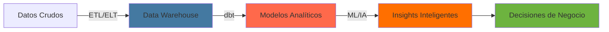

<div align="center">
  
# 👋 ¡Hola! Soy Daniel Montaño

### 🎓 Estudiante de Desarrollo de Software | 📊 Analytics Engineer | 🤖 Entusiasta de IA

[](https://www.linkedin.com/in/daniel-montaño-)
[](https://github.com/Dan13l-MEn)

</div>

---

## 🚀 Sobre Mí

```yaml
Nombre: Daniel Montaño
Enfoque Principal: Analytics Engineering
Formación: Estudiante de Desarrollo de Software
Interés Emergente: Inteligencia Artificial
Ubicación: En constante aprendizaje 🌎
Objetivo: Transformar datos en decisiones estratégicas con soluciones inteligentes
Pasión: Modelado de datos, pipelines analíticos y Machine Learning
```

Soy estudiante de **Desarrollo de Software** con un enfoque decidido hacia **Analytics Engineering**. Me apasiona diseñar pipelines de datos robustos, construir modelos analíticos confiables y documentados, y explorar cómo la **Inteligencia Artificial** puede potenciar el análisis de datos para generar soluciones innovadoras e impacto real en las organizaciones.

---

## 🛠️ Stack Tecnológico

### 📊 Analytics Engineering & Data


### 🤖 Inteligencia Artificial & ML


### 💻 Desarrollo de Software


### 🗄️ Bases de Datos & Warehousing


### 📈 Visualización de Datos


### 🔧 Herramientas & DevOps


---

## 🌱 Actualmente Aprendiendo

<table>
  <tr>
    <td align="center" width="33%">
      
      <br><strong>dbt & Modelado Analítico</strong>
      <br>Transformación de datos, testing y documentación
    </td>
    <td align="center" width="33%">
      
      <br><strong>Pipelines de Datos</strong>
      <br>ETL/ELT, orquestación con Airflow
    </td>
    <td align="center" width="33%">
      
      <br><strong>Machine Learning</strong>
      <br>Algoritmos de ML y Deep Learning aplicados a datos
    </td>
  </tr>
  <tr>
    <td align="center" width="33%">
      
      <br><strong>SQL Avanzado & Data Warehousing</strong>
      <br>Modelado dimensional, optimización de queries
    </td>
    <td align="center" width="33%">
      
      <br><strong>Docker & Cloud</strong>
      <br>Containerización de pipelines de datos
    </td>
    <td align="center" width="33%">
      
      <br><strong>Data Analysis & Visualization</strong>
      <br>Pandas, NumPy, Matplotlib, Power BI
    </td>
  </tr>
</table>

---

## 🎯 Áreas de Interés

<div align="center">

| 📊 Analytics Engineering | 🤖 Inteligencia Artificial | 💻 Desarrollo de Software |
|:---:|:---:|:---:|
| Modelado de Datos (dbt) | Machine Learning | APIs RESTful |
| Pipelines ETL/ELT | Deep Learning | Microservicios |
| Data Warehousing | NLP | Clean Code & SOLID |
| Data Quality & Testing | Computer Vision | Patrones de Diseño |
| Métricas & KPIs | MLOps | Arquitectura de Software |

</div>

---

## 📊 Estadísticas de GitHub

<div align="center">
  


</div>

---

## 🎯 Objetivos 2026

### 📊 Analytics Engineering
- 🔄 Dominar dbt y construir modelos analíticos documentados y testeados
- 🚀 Diseñar pipelines de datos end-to-end en producción
- 📈 Implementar métricas de calidad de datos (data quality)
- 🏗️ Aprender modelado dimensional (Star Schema, Snowflake)
- ☁️ Profundizar en plataformas cloud (BigQuery, Snowflake, Redshift)

### 🤖 Inteligencia Artificial
- 📚 Completar cursos de Machine Learning y Deep Learning
- 🧠 Construir modelos de ML aplicados a análisis de datos
- 🔬 Explorar MLOps para desplegar modelos en producción
- 🎓 Participar en competencias de Kaggle

### 🌟 General
- 📚 Contribuir a proyectos Open Source del ecosistema de datos
- 📝 Escribir artículos técnicos sobre Analytics Engineering e IA
- 🤝 Colaborar con la comunidad de datos y analytics

---

## 💡 Proyectos Ideales



Busco combinar mis habilidades de **analytics engineering** con **IA** para crear:
- 📊 Pipelines de datos automatizados y documentados con dbt
- 🔍 Modelos analíticos con capas de ML integradas
- 📈 Dashboards inteligentes con insights predictivos
- 🤖 Sistemas de detección de anomalías en datos
- 🎯 Soluciones de datos self-service para equipos de negocio

---

## 📫 Conecta Conmigo

<div align="center">

[](https://www.linkedin.com/in/daniel-montaño-)
[](mailto:arreoladaniel9825@gmail.com)
[](https://www.kaggle.com/dan13lmontao)

</div>

---

<div align="center">
  
### 💬 "Without data, you're just another person with an opinion." – W. Edwards Deming

### 🧠 "The goal is to turn data into information, and information into insight." – Carly Fiorina


⭐️ De [Dan13l-MEn](https://github.com/Dan13l-MEn)

</div>
