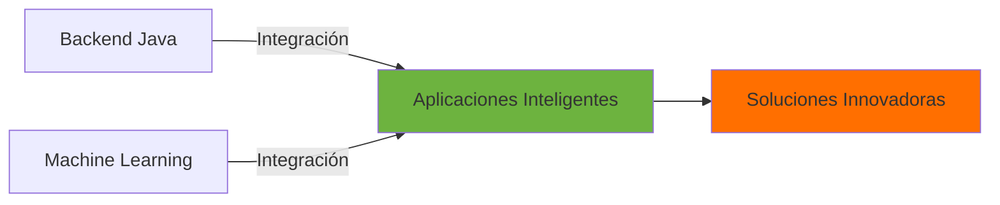

<div align="center">
  
# 👋 ¡Hola! Soy Daniel Montaño

### 💻 Desarrollador Backend Java | 🤖 Aspirante a Data Scientist | 🧠 Entusiasta de IA

[](https://www.linkedin.com/in/daniel-montaño-)
[](https://github.com/Dan13l-M)

</div>

---

## 🚀 Sobre Mí

```yaml
Nombre: Daniel Montaño
Enfoque Principal: Desarrollo Backend con Java
Interés Emergente: Inteligencia Artificial & Data Science
Ubicación: En constante aprendizaje 🌎
Objetivo: Fusionar desarrollo de software con IA para crear soluciones inteligentes
Pasión: Arquitectura de software, Machine Learning y análisis de datos
```

Soy estudiante de Desarrollo de Software con un enfoque determinado en convertirme en **Desarrollador Backend Java** y **Data Scientist**. Me apasiona crear aplicaciones de nivel empresarial robustas y escalables, mientras exploro el fascinante mundo de la **Inteligencia Artificial** y el análisis de datos para construir soluciones innovadoras e inteligentes.

---

## 🛠️ Stack Tecnológico

### 💼 Backend Development


### 🤖 Data Science & AI


### 🗄️ Bases de Datos


### 🔧 Herramientas & DevOps


---

## 🌱 Actualmente Aprendiendo

<table>
  <tr>
    <td align="center" width="33%">
      
      <br><strong>Spring Boot & Microservicios</strong>
      <br>Arquitectura de microservicios y patrones de diseño
    </td>
    <td align="center" width="33%">
      
      <br><strong>Docker & Kubernetes</strong>
      <br>Containerización y orquestación
    </td>
    <td align="center" width="33%">
      
      <br><strong>Machine Learning</strong>
      <br>Algoritmos de ML y Deep Learning
    </td>
  </tr>
  <tr>
    <td align="center" width="33%">
      
      <br><strong>RESTful API Design</strong>
      <br>Diseño de APIs robustas y escalables
    </td>
    <td align="center" width="33%">
      
      <br><strong>TDD (Test-Driven Development)</strong>
      <br>Desarrollo guiado por pruebas
    </td>
    <td align="center" width="33%">
      
      <br><strong>Data Analysis & Visualization</strong>
      <br>Pandas, NumPy, Matplotlib, Seaborn
    </td>
  </tr>
</table>

---

## 🎯 Áreas de Interés

<div align="center">

| 🚀 Backend Development | 🤖 Inteligencia Artificial | 📊 Data Science |
|:---:|:---:|:---:|
| Microservicios | Machine Learning | Análisis de Datos |
| APIs RESTful | Deep Learning | Visualización de Datos |
| Arquitectura Empresarial | NLP (Procesamiento de Lenguaje Natural) | Modelado Predictivo |
| Clean Code & SOLID | Computer Vision | Big Data Analytics |
| Patrones de Diseño | Redes Neuronales | Estadística Aplicada |

</div>

---

## 📊 Estadísticas de GitHub

<div align="center">
  


</div>

---

## 📈 Actividad de Código

<!--START_SECTION:waka-->
<!--END_SECTION:waka-->

---

## 🎯 Objetivos 2026

### 💻 Backend Development
- ✅ Dominar Spring Boot y su ecosistema
- 🔄 Construir proyectos con arquitectura de microservicios
- 🚀 Desarrollar aplicaciones escalables en producción
- 🏆 Obtener certificaciones en Java

### 🤖 Data Science & AI
- 📚 Completar cursos de Machine Learning y Deep Learning
- 🧠 Construir modelos de ML para resolver problemas reales
- 📊 Dominar análisis exploratorio de datos (EDA)
- 🎓 Aprender frameworks como TensorFlow y PyTorch
- 🔬 Participar en competencias de Kaggle

### 🌟 General
- 📚 Contribuir a proyectos Open Source
- 📝 Escribir artículos técnicos sobre mis aprendizajes
- 🤝 Colaborar con otros desarrolladores y data scientists

---

## 💡 Proyectos Ideales



Busco combinar mis habilidades de **desarrollo backend** con **IA y Data Science** para crear:
- 🎯 Sistemas de recomendación inteligentes
- 🔍 APIs con capacidades de ML integradas
- 📈 Aplicaciones empresariales con análisis predictivo
- 🤖 Chatbots y asistentes inteligentes
- 📊 Dashboards con insights automáticos basados en datos

---

## 📫 Conecta Conmigo

<div align="center">

[](https://www.linkedin.com/in/daniel-montaño-)
[](arreoladaniel9825@gmail.com)
[](#)
[](https://www.kaggle.com/dan13lmontao)

</div>

---

<div align="center">
  
### 💬 "The science of today is the technology of tomorrow." – Edward Teller

### 🧠 "Data is the new oil, but AI is the new electricity."


⭐️ De [Dan13l-M](https://github.com/Dan13l-M)

</div>
